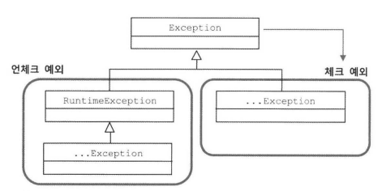

# 4장 - 예외

## Intro

* 개발자가 신경쓰기 귀찮은 영역 - 예외처리
* 이번 장에서는...
  * 스프링의 데이터 엑세스 기능의 예외처리
  * 예외를 처리하는 베스트 프랙티스

## 4.1. 사라진 SQLException

```java
    public void deleteAll() throws SQLException {
        this.jdbcContext.executeSql("delete from users");
    }
```

```java
    public void deleteAll() {
        this.jdbcTemplate.update("delete from users");
    }
```

* SQLException 의 행방은?

### 4.1.1. 초난감 예외처리

* 대표적인 초난감 예외처리 대표주자들!
  * 예외 블랙홀
    ```java
        try {

        } catch(SQLException e){
        }
    ```
    * 예외를 받고 아무것도 하지 않음
    * 발생한 예외를 무시해버리는 상황 발생
    * 이런 코드를 작성시 문제는 나중에 오류가 있어 예외발생시 어디에서 문제가 생기는지 전혀 알수 없게 되버린다는 점이다.
    ```java
    } catch(SQLException e){
        System.out.println(e);
    }
    ```

    ```java
    } catch(SQLException e){
        e.printStackTrace();
    }
    ```
    * 위의 둘도 문제가 많음
    * 콘솔 로그에만 찍히게 되는데, 누가 직접 콘솔을 계속 보고 있지 않는 한 이 메시지를 볼수 없다.
    * SQLException의 발생 이유
      * SQL문법에러
      * DB에서 처리할수 없을 정도의 데이터 액세스 로직에 심각한 버그
      * 서버가 죽음 혹은 네트워크가 끊김
    * 최소한 이렇게라도 해야 함
    ```java
    } catch(SQLException e){
        e.printStackTrace();
        System.exit(1);
    }
    ```

  * 무의미하고 무책임한 throws
    * 메소드 선언에 throws Exception을 기계적으로 붙임
    ```java
        public void method1() throws Exception {
            method2();
        }
        public void method2() throws Exception {
            method3();
        }
        public void method3() throws Exception {
            ...
        }
    ```
    * 남용하면 throw 선언이 의미없어져 버림. 
    * 실행 중 정말 예외 상황이 발생할 수 밖에 없는 메소드인지 부르는(사용하는) 쪽에선 알수 없게 되어버림
* 예외처리를 할때 반드시 지켜야 될 핵심 원칙(둘중에 하나가 되어야...)
  * 예외는 적절하게 복구
  * 작업을 중단시키고 운영자 또는 개발자에게 분명하게 통보

### 4.1.2. 예외의 종류와 특징

* 어떻게 처리해야 하는가? 오랫동안 논쟁이 되온 부분
* 특히 체크 예외(cheched exception)의 명시적으로 처리가 필요한 예외를 다루는 방법이 큰 이슈였음

* 예외는 크게 3가지 종류
  * Error
    * java.lang.Error 클래스와 그 서브 클래스
    * VM에서 비정상적인 상황 발생할 경우
    * 애플리케이션에서 해결할 수 없는 상황인 경우(OutOfMemoryError ThreadDeath 등)
    * 개발자가 신경쓰지 않아도 됨
  * Exception

    

    * java.lang.Exception 클래스와 그 서브 클래스
    * 애플리케이션 코드 작업중에 예외상황이 발생할 경우에 사용
    * 다시 체크예외와 언체크 예외로 나뉨
      * Exception과 체크 예외
        * RuntimeException을 상속하지 않음
        * 반드시 catch문으로 예외를 잡아 처리하거나 throws 선언이 필요
      * RuntimeException과 언체크/런타임 예외
        * RuntimeException 클래스와 그 서브 클래스
        * 명시적인 예외처리를 강제하지 않음. 즉 catch 문이나 throws 선언을 꼭 하지 않아도 됨
        * 주로 프로그램의 오류가 있을 때 발생하도록 의도한 것 - 예) NullPointerException

### 4.1.3. 예외처리 방법

* 예외 복구
  * 예외상황을 파악하고 문제를 해결해서 정상 상태로 돌려놓는 것
  * 예1) 사용자가 요청한 파일을 읽으려고 시도했는데 해당 파일이 없다거나 다른 문제가 있어 IOException이 발생
    * 사용자에게 다른 파일을 이용하도록 안내함
  * 예2) 네트워크가 불안해서 가끔 접속이 안되는 시스템. 원격DB 서버 접속 실패해서 SQLException이 발생한 경우
    * 일정 시간 대기후 접속 재시도. 이것을 정해진 횟수만큼 시도. 실패했다면 복구 포기

```java
    int maxretry = MAX_RETRY;
    while(maxretry -- >0) {
        try {
            ...     // 예외가 발생할 가능성이 있는 시도
            return; // 작업 성공
        catch(SomeException e) {
            // 로그 출력. 정해진 시간만큼 대기
        finally {
            // 리소스 반납. 정리 작업
        }
        throw new RetryFailedException(); // 최대 재시도 횟수를 넘기면 직접 예외 발생.
```

* 예외 처리 회피
  * 예외처리를 자신이 담당하지 않고 자신을 호출한 쪽으로 던져버리는 것
  * throws문으로 선언해서 예외가 발생하면 알아서 던저지게 하거나 catch문으로 일단 예외를 잡은 후에 로그를 남기고 다시 예외를 던지는 것(rethrow)
  * 자신이 사용하는 쪽에서 예외를 다루는게 최선의 방법일 때 사용
  * 예) JdbcTemplate에서 사용하는 콜백 오브젝트는 ResultSet이나 PrepareStatement 등을 이용해서 작업하다 발생하는 SQLException을 자신이 처리하지 않고 템플릿으로 던져버림
    * SQLException 처리는 콜백오브젝트의 역할이 아니라 템플릿의 역할이라고 생각하기 때문
  * 이와같이 명확히 예외를 다루는 것이 자신이 사용하는 쪽에서 해야한다고 판단될때 써야한다.

  * 예외처리 회피 1

```java
    public void add() throws SQLException {
        // JDBC API
    }
```

* 예외처리 회피2

```java
    public void add() throws SQLException {
        try {
            // JDBC API
        } catch(SQLException e) {
            // 로그 출력
            throw e;
        }
    }
```

* 예외 전환(exeception translation)
  * 발생한 예외를 그대로 넘기지 않고 적절한 예외로 전환해 던짐
  * 보통 2가지 목적으로 사용
    * 내부에 발생한 예외를 좀더 적절하고 분명한 의미를 가진 예외로 바꿔서 던지기 위해
      * 예) 새로운 사용자를 등록하려고 시도했을 때 아이디가 같은 사용자가 있어 DB에서 JDBC API의 SQLException 발생시킴. DAO에서는 이 정보를 좀더 의미있게 해석해서 SQLException에러를 잡아서 DuplicationUserIdException 같은 예외를 정의해서 던짐.
    * 예외를 처리하기 쉽고 단순하게 만들기 위해 포장하는 것
      * 예외처리를 강제하는 체크예외를 언체크 예외(런타임 예외)로 바꾸는 경우
      * 대부분 서버환경에서는 애플리케이션 코드에서 처리하지 않고 전달된 예외들을 일괄적으로 다룰수 있는 기능을 제공함
      * 어차피 복구못할 예외라면 애플리케이션 코드에서는 런타임 예외로 포장해서 던지고 예외처리 서비스 등을 이용해 로그를 남기고, 관리자에게 메일로 통보, 사용자에게 안내 메시지를 보여주는 것이 바람직

  * 체크 예외를 언체크 예외로 포장해서 던짐(SQLException -> EJBException)

```java
    try {
        OrderHome orderHome = EJBHomeFactorY.getlnstance().getOrderHome();
        Order order = orderHome.findByPrimaryKey(Integer id);
    } catch (NamingException ne) (
        throw new EJBException(ne);
    } catch (SQLException se) (
        throw new EJBException(se);
    } catch (RemoteException re ) (
        throw new EJBException(re)
    }
```
